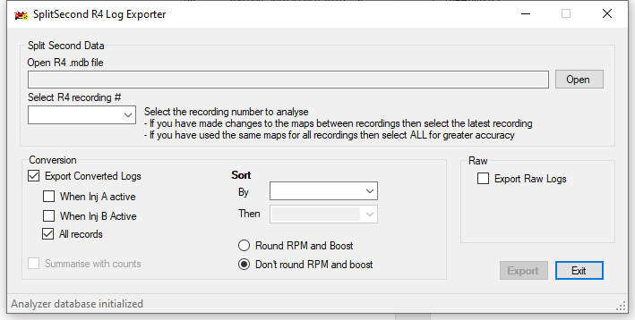

# r4analyzer
Export tool for SplitSecond R4 engine management software.  Exports R4 log data to .csv file.  Useful for analysis of Air-Fuel ratios or other diagnosis.

## Features
* Raw export - export from the internal R4 Access format to .csv file
* Convert data on export - convert from the raw format into values as they are displayed in the software
* Data is copied to a SQLite database as part of the export process, freeing the data from the proprietary Access format.  SQLite databases can be accessed with freely available toos.
* Options
  * Export all records
  * Export a single session or all sessions
  * Export only where outputs are active
  * Sort output by multiple fields
  * Round RPM to nearest 500 rpm increment on export (to align with map)
  * Round boost to nearest 0.5 psi (to align with map)
  
## Usage Notes
This software was built to be compatible with my usage of the R4 software.  
* Map A is interpreted as degrees of timing retard
* Map B is interpeted as milliseconds of auxiliary injector time
* Aux C input is interpreted as boost in psi

Please contact me if your usage differs and I will see if I can accomodate your usage in the code
  
***Note:*** *This software has no association with SplitSecond and is not supported nor endorsed by SplitSecond.  This software is provided as-is with no support.*
